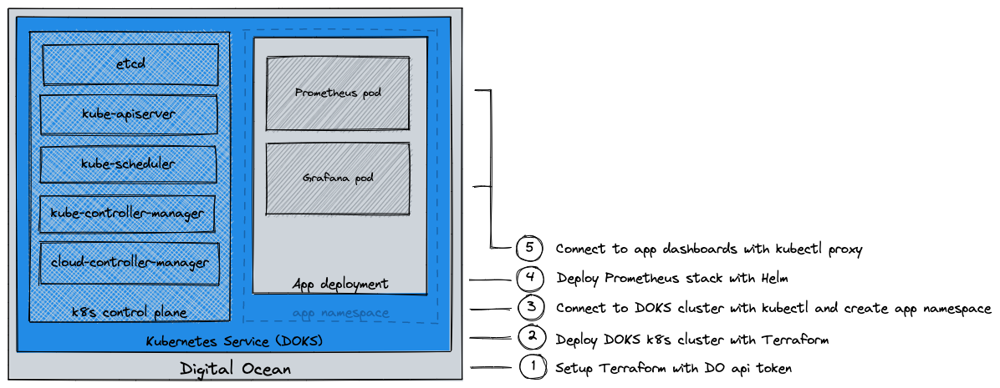

# Deploy Kubernetes as a Service in Digital Ocean

This repository contains code to create a Digital Ocean Kubernetes Service (DOKS) cluster.
Instructions to deploy an application workload to the DOKS cluster are also included.

## Pre-requirements

- [doctl installed](https://docs.digitalocean.com/reference/doctl/how-to/install/)
- [kubectl installed](https://kubernetes.io/docs/tasks/tools/install-kubectl-macos/)
- [helm installed](https://helm.sh/docs/intro/install/)

## Overview

## Setup Terraform with the DO api token

1. Generate a Digital Ocean Personal Access Token (aka api token) as explained [here](https://docs.digitalocean.com/reference/api/create-personal-access-token/).
2. Copy and paste the api token into *terraform.tfvars*.

## Deploy Digital Ocean Kubernetes Service (DOKS)

1. Set `region` and `vpc name` in *terraform.tfvars*.
2. Optionally the node pool sizing can configured in *main.tf* to.  The defaults should be good enough for testing though.
3. Run `terraform apply` in this folder

## Connecting to DOKS with kubectl

1. Terraform will automatically create a copy of the KUBECONFIG and place it in ./files/kubeconfig.yaml
2. Run `export KUBECONFIG=files/kubeconfig.yaml` to configure `kubectl` and have it connect the DOKS cluster.
3. Run `kubectl cluster-info` to confirm the configuration has be set properly.

## Pick a workload from the DO marketplace

Applications to deploy in DOKS can be manually chosen in the DO Marketplace. However Infrastructure as Code (IaC) is prefered.
All kubernetes apps in the DO Marketplace are directly linked to their official pages on [artifacthub.io](https://artifacthub.io). See the "included software" section for each app in the DO Marketplace for a link to the corresponding artifacthub.io page. This is where the link the the helm chart can be found. This helm chart will later be used to deploy your application in DOKS.

## Deploy workload (Prometheus stack)

1. Setup a namespace for the app deployment: 
   1. Run `kubectl apply -f files/monitoring.yaml`.
2. Create an overwrite file to overwrite default settings in the Prometheus Helm chart. Open the overwrite file and set the Grafana admin password. See this [Digital Ocean documentation page](https://www.digitalocean.com/community/tutorials/how-to-set-up-digitalocean-kubernetes-cluster-monitoring-with-helm-and-prometheus-operator) for more info.
3. deploy helm chart: 
   1. run `helm install --namespace monitoring my-kube-prometheus-stack -f files/override_prometheus-operator.yaml prometheus-community/kube-prometheus-stack --version 45.2.0`.

## Connecting to the dashboards

1. No service is exposed via a loadbalancer to the public internet, but the services and dashboard can be reached with kubectl port-forward.
2. Connect to the kubernetes dashboard
   1. This dashboard can only be reached via the DO webconsole. Login to the DO web console, navigate to your Kubernetes cluster and click on *Kubernetes dashboard* in the top right.
3. Connect to prometheus dashboard:
   1. Run `kubectl port-forward -n monitoring svc/my-kube-prometheus-stack-grafana 3000:80 &`
   2. Open browser and go to `http://localhost:3000`
4. Connect to grafana dashboard: 
   1. Run `kubectl port-forward -n monitoring svc/my-kube-prometheus-stack-prometheus 9090:9090 &`
   2. Open browser and go to `http://localhost:9090`

## Extra insight into what was deployed

In order to get a full overview of what was deployed:

1. Run `kubectl get statefulsets --namespace monitoring` to get an overview of the deployed statefulsets.
2. Run `kubectl describe statefulset --namespace monitoring name-of-statefulset > files/name-of-statefulset.yaml`.
3. Open `files/name-of-statefulset.yaml` in any texteditor.

## Delete the deployment

1. Run `helm delete --namespace monitoring my-kube-prometheus-stack`.
2. Run `terraform destroy`.

## TODO

1. Create terraform outputs:
   1. Kubernetes dashboard url === OR doctl command to get the Dashboard url
   2. Grafana dashbaord url
   3. Prometheus dashboard url

## Roadmap

1. Monitor Vault deployment in AWS from prometheus in DOKS.

## Sources

[source 0](https://docs.digitalocean.com/products/kubernetes/how-to/connect-to-cluster/) - Basics of how to connect to DOKS with kubectl.  
[source 1](https://www.digitalocean.com/community/tutorials/how-to-install-software-on-kubernetes-clusters-with-the-helm-2-package-manager) - Explains general info about deploying on DOKS without IaC.  
[source 2](https://www.digitalocean.com/community/tutorials/how-to-set-up-digitalocean-kubernetes-cluster-monitoring-with-helm-and-prometheus-operator) - Explains the process, few steps outdated.  
[source 3](https://docs.digitalocean.com/tutorials/build-deploy-first-image/) - Explains the memory overhead on k8s worker nodes.  
[source 4](https://alexanderzeitler.com/articles/enabling-the-kubernetes-dashboard-for-digitalocean-kubernetes/) - Connect to the Kubernetes dashboard without going through DO webgui.  
[artifacthub.io/kube-prometheus-stack](https://artifacthub.io/packages/helm/prometheus-community/kube-prometheus-stack) - Official page of the Kubernetes Prometheus/Grafana stack.  
